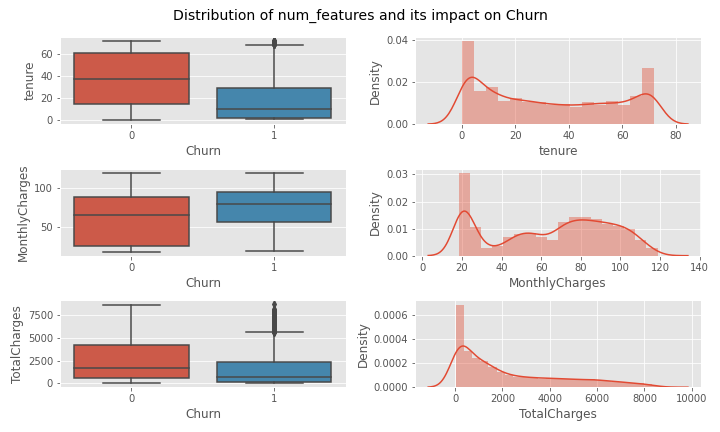
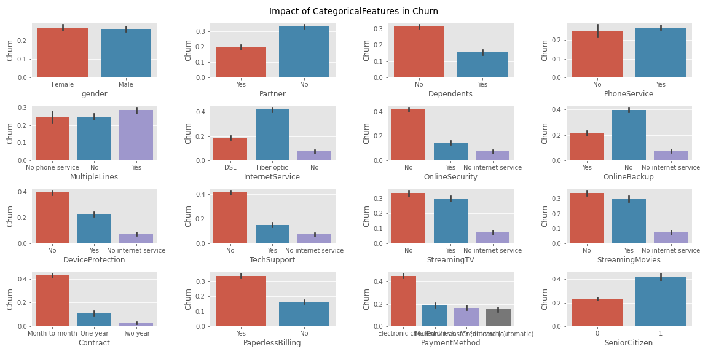
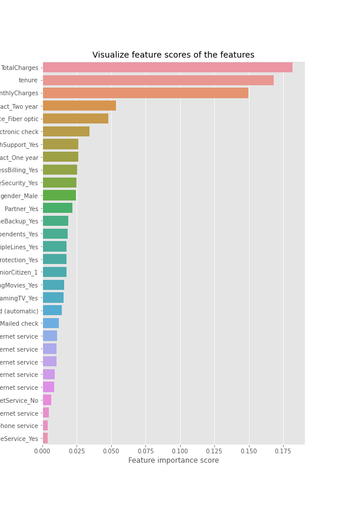

# Customers-Churn-Prediction
## Overview
Churn is a widespread problem across almost every industry. However, it is especially relevant to the telecommunications market, as many believe it to have reached saturation point. Competition is at an all-time high and many telcos are recognizing the need to improve customer experience and service in order to lower customer churn rates and compete effectively.  

## File Explanation
= ChurnPrediction.ipynb: This file contains the baseline models without detail analysis. 
- ChurnPrediction..ipynb: This is the main file. It contains detail analysis and improvement of earlier built baseline models
- ChurnPrediction3.ipynb: This file is exactly same as ChurnPrediction..ipynb except that here i used only important features to build predictive     model.

## Daataset
The dataset for this project is obtained from the kaggle.  
### Contents
Each row represents a customer, each column contains customer’s attributes described on the column Metadata.

The data set includes information about:

- Customers who left within the last month – the column is called Churn
- Services that each customer has signed up for – phone, multiple lines, internet, online security, online backup, device protection, tech support,     and streaming TV and movies
- Customer account information – how long they’ve been a customer, contract, payment method, paperless billing, monthly charges, and total charges
- Demographic info about customers – gender, age range, and if they have partners and dependents

## Task
The task is to predict the customer churn event and find the features that influence the Churn rate most.  

## Key Insights obtained
#### Impact of Numerical features

  
- Tenure: Customers who have been with the company for less months by the quarter have high churn rate. Also we see that the <i>tenure</i> variable   is stacked at the tail, so the large proportion of customers have either been had the shortest (1 month) or longest (72 months) tenure.
- MOnthlyCharges: Customers with high monthly charge in average have high churn rate. It aslo seem as if <i>MonthlyCharges</i> variable is normally   distributed around dollar 80  with large stack near lower rates
- TotalCharges: Customers who have low total charge in average have high churn rate. This variable is also positively skewed with large stack at lower reates.

#### Impact of Categorical Features

  
<ul>
    <li>gender: gender of customers have no significant affect on Churn event.</li>
    <li>Partner: customers without partners seems have high churn.</li>
    <li>Dependents: customers without dependents seems to have high Churn events.</li>
    <li>PhoneService: wheather customers signed up for home phone services or not doesnot seems to affect Churn event that much though those who have subscribed have slighlty high Churn in average.</li>
    <li>MultipleLines: customers who have singed up for services from multiple lines in average have slightly higher churn event than those who did not.</li>
    <li>InternetService: In average, about 44% of customers who have subscribed for internet for Fiber Optics have churn events. Similiarly, in average, about 18% customers who have used DSL for internet service have churn event. And about 7-8 % of customers who have not signed up for internet service have churn event. So, in average, customers who have subscribed internet with Fiber Optics have high churn rate</li>
    <li>OnlineSecurity: In average, customers who have not signed up for additional online security services have high churn rate.</li>
    <li>OnlineBackup: Customers eho have not subscribed for online backup have high churn (~40% in average). And around 22% Customers who have not subscribed of online backup have churn event in average. Around 8% custoemrs in average with no internet service have churn event.</li>
    <li>DeviceProtection: In average, customers who have not subscribed for additional device protection plan for their internet equipments with the company have high churn rate.<li>
    <li>TechSupport: Customers who have not signed up for tech support have higher churn event (~43%) than the customers who have  signed up (~15%).</li>
    <li>StreamingTV: Customers who uses internet for streaming TV showss have slightly higher Churn event (~35% in average) than those who have (~30% in average).</li>
    <li>StreamingMovies: About 35% of Customers in average who have not signed up for movies streaming service have churn event while about 30% of customers in average who have singed up for this service have churn rate. Around 17 % of customers in average who haved churned had no internet service for streaming</li>
    <li>Contract: Around 45% of customers who have contract term of less than one year (i.e. month-to-month) have churn event in average in contrast to around 12% of customers with one year contract and around 4% of customers with 2 years contract term. So it means lower the contract periods/term higher the chances of churn.</li>
    <li>PaperlessBilling: Around 35% of customers in average who had paperless billing service have churn event in contrast to  around 16% of customers kn average without paperless biling.</li>
    <li>PaymentMethod: Customers with payment method of electronic check have high churn event in average. While ohter methods don't have significant difference in churn event.</li>
    <li>SeniorCitizen: Customers who are senior citizens have higher chum rate in average than those who aren't.</li>
</ul>

## Modeling Result
The data had skewed distribution i.e. Class Imbalance. To deal with this problem i used oversampling method to oversample minority class label.  
Since most of the features are categorical, tree based classifiers are more suited for this particular data. I used Random Forest classifier and Decision Tree classifier for predictive modeling. Also i applied **mutual class info** to obtain important features for predictive modeling and built odel based on these important features.  

 
  

As we can see from the feature importance plots above, the most important features are:  
- Customer's TotalCharges 
- Customer's monthlyCharges
- Customer's tenure(number of months customer has been with the company) with the comapny
- Customer's contract with the company
- Internet Sevices customers have subscribed
- Tech support service customers have subscribed

